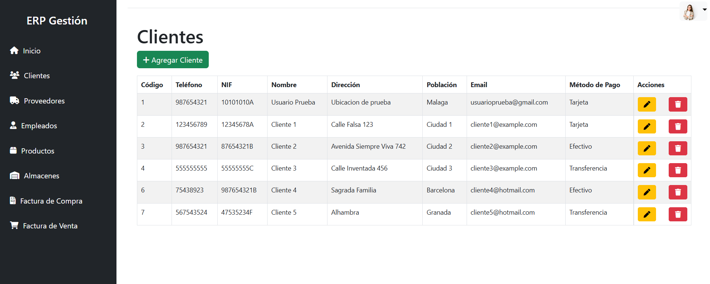

# 📡 Telecom ERP

**Stack:** HTML | CSS | PHP | JavaScript | MySQL  
**Estado:** En desarrollo

🌐 **Demo:** [http://localhost/telecom/index.php](http://localhost/telecom/index.php)

## 📸 Capturas
  
  

---

## 📝 Descripción
Telecom ERP es una aplicación web para gestionar un negocio ficticio: clientes, proveedores, empleados, productos y facturas. Todo pensado para que puedas hacer operaciones CRUD de forma sencilla y mantener tus flujos de trabajo organizados.  

**Equipo:** Avalob, nattfer, ATreCro y @zemanue

---

## ✨ Características
- Inicio de sesión y registro de usuarios.  
- Gestión completa de clientes, proveedores, empleados, almacenes y productos.  
- Creación, edición y eliminación de facturas de compras y ventas.  
- Validaciones que evitan datos incoherentes (por ejemplo, productos sin proveedor o almacén).  
- Diseño responsive con **Bootstrap**.  
- Arquitectura siguiendo el patrón **MVC** (Modelo-Vista-Controlador).  

---

## 🛠 Tecnologías
- **Backend:** PHP, JavaScript  
- **Frontend:** HTML, CSS, JavaScript, Bootstrap  
- **Base de datos:** MySQL  
- **Servidor local:** XAMPP  

---

## 🚀 Cómo probarlo
1. Clona el repositorio:  
```bash
git clone https://github.com/your-repo/Telecom-ERP.git
